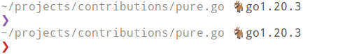

# pure.go 🐐

> Exploring [Golang][go] by re-implementing [pure][pure] prompt.
>
> :information_source: This is a really basic and naive implementation.

### Preview



## Installation

1. Download the [release] binary for your OS/Arch
2. Allow execution

    ```sh
    chmod u+x /path/to/pure
    ```

3. Try to execute manually

    ```sh
    $ /path/to/pure -version --last-command-status $status
    # should print something like:
    ~/projects/contributions/pure.go 🐐go1.20.3
    0 ❯
    ```

4. Edit your [Fish](#fish), [Zsh](#zsh) or [Bash](#bash) prompt (see below).

## Configuring Shell Prompt

### Fish

Edit `$__fish_config_dir/functions/fish_prompt.fish` with:

```fish
function fish_prompt
    /path/to/pure -version --last-command-status $status
end
```

### Zsh

```zsh
PROMPT=$(/path/to/pure -version --last-command-status $status)
```

### Bash

```sh
export PS1='$(/path/to/pure -version --last-command-status $status)'
```

## Development

### Usage

```sh
❯ go run ./cmd/cli.go -version --last-command-status $status
```

or with the built binary

```sh
❯ make build
❯ ./pure --last-command-status $status
# or
❯ make demo
```

### Install

```sh
❯ make install
```

### Test

```sh
❯ make test
```

## Build

Create a `pure` binary in the project's root directory.

```sh
❯ make build
❯ ./pure --last-command-status $status
```

## Todo

* [x] create a `pure` package
  * [x] add `pure` package to `go.mod`
  * [x] add `pure` package to `go.sum`
* [x] print prompt `❯` with `pure` package
* [x] test pure package output (with [`testify`][test])
* [x] create a CLI (with [`clîr`][cli])
* [x] add current working directory to prompt
* [x] add `go version` to prompt when `go.sum` exists
* [x] configure Goreleaser
* [x] add color to output

[test]: https://github.com/stretchr/testify/
[cli]: https://github.com/leaanthony/clir
[release]: https://github.com/edouard-lopez/pure.go/releases/
[pure]: https://github.com/pure-fish/pure/
[go]: go.dev/
